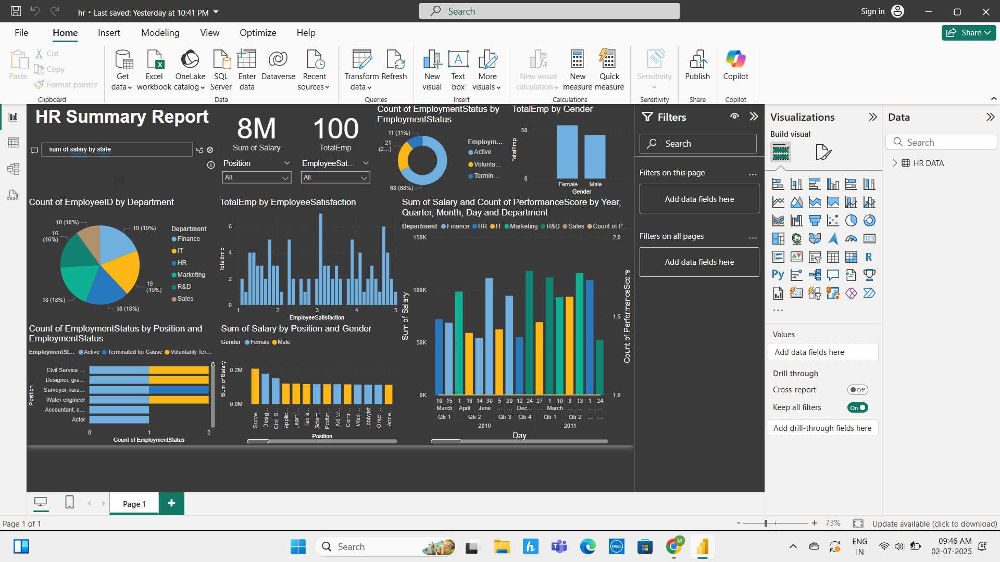

# 💼 HR Analytics Dashboard - Power BI

This project is a Human Resources dashboard built in Power BI to analyze and visualize employee-related data.

## 📊 Dashboard Features:
- Total Employees and Salary Overview
- Employee Count by Department and Gender
- Employment Status Distribution (Active, Terminated, etc.)
- Salary by Job Position and Gender
- Performance Score Trends by Year, Quarter, Month, and Day
- Employee Satisfaction Breakdown
- Interactive Filters for Position and Satisfaction

## 📁 Files Included:
- `HR-Dashboard.pbix`: The Power BI dashboard file
- `HR DATA.xlsx`: The Excel dataset used
- `Screenshots/`: Preview images of the dashboard

## 🖼️ Dashboard Preview:

## 🔧 Tools Used:
- Power BI
- Excel
